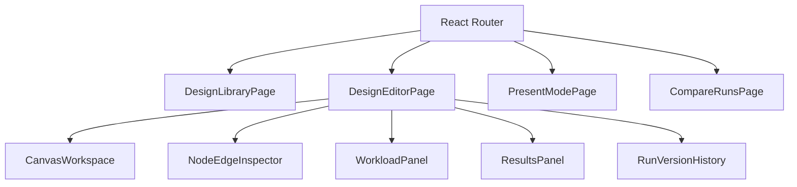

# Next Version: Frontend Modularization Plan

**Status:** Planned  
**Depends on:** [00-office-use-case.md](./00-office-use-case.md), trust labeling from [01-simulator-trust.md](./01-simulator-trust.md)

## Problem

[`client/src/screens/app-shell.tsx`](../../client/src/screens/app-shell.tsx) (~3570 lines) owns canvas, inspector, workload, results, history, versions, autosave, and comparison. That blocks:

- deep compare / present / export features
- unit tests around editor state
- shareable `/designs/:id` routes
- client-side validation preflight attached to nodes/edges

## Target information architecture

## Proposed routes

| Route | Purpose |
| --- | --- |
| `/` | Design library: blanks, samples, recent saved designs |
| `/designs/new` | Blank editor |
| `/designs/:designId` | Saved design editor (deep link) |
| `/designs/:designId/present` | Read-only meeting mode |
| `/designs/:designId/compare?left=&right=` | Run or variant comparison |
| `/draft` | Unsaved ad-hoc editor (current adhoc behavior) |

Backend today has no `GET /designs` list. Add it in the same milestone as the library page (see [04-productization.md](./04-productization.md)).

## Module split (from AppShell)

Extract in this order to keep the app runnable after each step:

1. **`lib/editor-state.ts`** — draft snapshot, dirty flag, undo stack helpers (pure functions first).
2. **`lib/graph-validation.ts`** — client preflight mirroring `graphs.ValidateGraph` ModeRun (client count, cycles, cache rules, empty flows). Surface issues as `{ nodeIds, edgeIds, messages }`.
3. **`components/canvas-workspace.tsx`** — React Flow surface + drag/drop.
4. **`components/node-edge-inspector.tsx`** — selected node/edge editors.
5. **`components/workload-panel.tsx`** — workload fields + run CTA.
6. **`components/results-panel.tsx`** — bottleneck, paths, assumptions, flow tabs.
7. **`components/history-panel.tsx`** — versions + runs.
8. **`hooks/use-design-persistence.ts`** — save / autosave / duplicate / load sample.
9. **`hooks/use-simulation.ts`** — createRun + baseline compare state.
10. **`screens/design-editor-page.tsx`** — composition root replacing AppShell.

Keep [`api.ts`](../../client/src/lib/api.ts) and [`design-draft.ts`](../../client/src/lib/design-draft.ts); grow them rather than inventing a second client.

## Validation preflight UX

- Run button disabled or warned when ModeRun issues exist.
- Canvas nodes/edges with issues get a distinct border and tooltip.
- Full error list in a dismissible banner (replace brand-copy feedback as primary error channel).
- Call backend validation still as source of truth; client preflight is best-effort for speed.

## Deeper compare / export (FE scope)

### Compare v1 (same milestone as modularization)

- Per-node utilization table: baseline vs latest (all nodes, not only bottleneck).
- Delta columns: util, latency, dropped, incoming RPS.
- Highlight nodes that crossed 80% / 100%.

### Compare v2 (office workflow doc)

- Side-by-side canvases for two design IDs (variants).
- Graph structural diff (added/removed nodes/edges).

### Export v1

- JSON download of design graph.
- Markdown summary: design name, workload, bottleneck explanation, top 5 saturated nodes, critical path.

Reuse `buildRunComparison` logic; move to `lib/run-comparison.ts`.

## Testing plan

| Layer | Tool | Coverage |
| --- | --- | --- |
| Pure helpers | Vitest | validation preflight, comparison deltas, draft builders |
| Components | Vitest + Testing Library (add if missing) | inspector field updates, workload parse errors |
| Smoke | Manual / Playwright later | load sample → run → see bottleneck |

## Migration rules

- No big-bang rewrite: extract one panel per PR.
- Preserve current autosave and undo behavior.
- Do not restyle the entire studio in the same PRs as the split.

## Acceptance criteria

- [ ] `app-shell.tsx` either deleted or reduced to a thin re-export
- [ ] `/designs/:id` loads a saved design after refresh
- [ ] Client preflight blocks obvious invalid runs before network
- [ ] Compare shows per-node deltas for two runs
- [ ] Export downloads JSON + markdown for the active design/run
